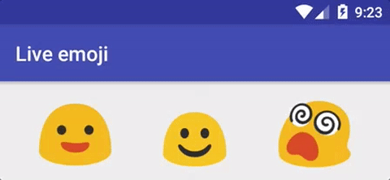

# Live emojis



Animating Google emojis with Android animated vector drawables.

All credits to [noto-emoji](https://github.com/googlei18n/noto-emoji) for the original emoji.

## Can't see your favourite emoji?

- Find the svg [there](https://github.com/googlei18n/noto-emoji) and play with it. Then submit a PR, I'll be happy to review it!
- Or just post an issue with your idea. The more the merrier!

## Contributors

- [romainpiel](https://github.com/RomainPiel)
- [chiuki](https://github.com/chiuki)
- [sjthn](https://github.com/sjthn)

## License
```
Copyright 2016 Romain Piel

Licensed under the Apache License, Version 2.0 (the "License");
you may not use this file except in compliance with the License.
You may obtain a copy of the License at

   http://www.apache.org/licenses/LICENSE-2.0

Unless required by applicable law or agreed to in writing, software
distributed under the License is distributed on an "AS IS" BASIS,
WITHOUT WARRANTIES OR CONDITIONS OF ANY KIND, either express or implied.
See the License for the specific language governing permissions and
limitations under the License.
